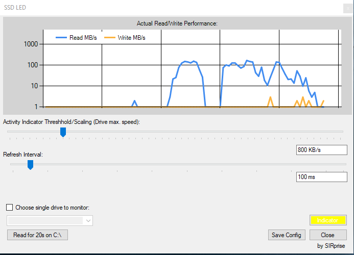

Build status (AppVeyor / GitHub Action)

# SSD-LED
 Drive Activity Indicator

System-Tray-icon:

Preferences window:

## Downloads
**Releases:** 

[https://github.com/SIRprise/SSD-LED/releases]

**Nightlies (automatic compilation on change and compile logs):**

see Artifacts at [https://github.com/SIRprise/SSD-LED/actions] and [https://ci.appveyor.com/project/SIRprise/SSD-LED]
